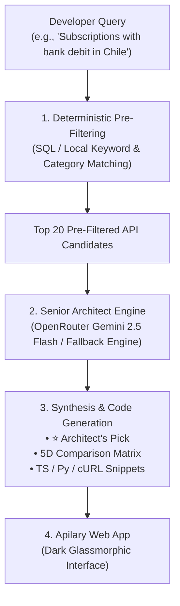

# Apilary — Your AI Integration Architect

> **Apilary** is an intelligent developer copilot that solves the API decision paralysis problem. Instead of browsing unstructured directories or search engines, developers describe their technical stack and operational requirements in natural language. Apilary acts as a Senior Tech Lead: evaluating real-world trade-offs, delivering an opinionated **Architect's Recommendation**, comparing solutions across 5 key operational dimensions, and generating production-ready integration code.

---

## ⚡ Key Highlights

- **⭐ The Architect's Recommendation**: Clear, opinionated recommendation of the #1 API for your specific scenario, including strengths, operational risks, and explicit "when NOT to use" anti-patterns.
- **📊 5-Dimension Operational Matrix**: Direct side-by-side evaluation covering Latency & Reliability, Pricing & Free Tier, Developer Experience (DX), Integration Complexity, and Scalability.
- **💻 Production-Ready Code Generator**: Instant, strongly-typed boilerplate for **TypeScript (Fetch)**, **Python (Requests)**, and **cURL**.
- **🎯 200+ Hand-Curated APIs**: High-signal catalog spanning Payments (including LATAM & US/EU), AI/ML, Speech, Storage, Database, Auth, Observability, and Communications.
- **💸 Zero-Budget Architecture**: Operates 100% within the free tiers of Next.js / Vercel, Supabase (PostgreSQL), and OpenRouter (Gemini 2.5 Flash).

---

## 🏗️ Architecture & Pipeline



---

## 🚀 Quickstart Guide

### 1. Clone & Install Dependencies
```bash
git clone https://github.com/your-org/apilary.git
cd apilary
npm install
```

### 2. Configure Environment Variables
Copy `.env.example` to `.env.local`:
```bash
cp .env.example .env.local
```

Configure your keys in `.env.local`:
```env
# Optional: Supabase Connection (falls back to local JSON dataset if empty)
NEXT_PUBLIC_SUPABASE_URL=https://your-project.supabase.co
NEXT_PUBLIC_SUPABASE_ANON_KEY=your-anon-key
SUPABASE_SERVICE_ROLE_KEY=your-service-role-key

# Optional: OpenRouter API Key (uses built-in Architect Engine if empty)
OPENROUTER_API_KEY=your-openrouter-key
```

### 3. (Optional) Ingest Seed Dataset into Supabase
Run the database migration in `supabase/migrations/01_schema.sql`, then seed:
```bash
npm run seed
```

### 4. Run Locally
```bash
npm run dev
```
Open [http://localhost:3000](http://localhost:3000) in your browser.

---

## 🧪 Smoke Testing Suite

To validate the integration logic across 10 real-world architectural scenarios:
```bash
npm run test:smoke
```

---

## 📦 Deployment on Vercel

1. Push your repository to GitHub.
2. Import the repository into [Vercel](https://vercel.com).
3. Set the Environment Variables (`NEXT_PUBLIC_SUPABASE_URL`, `NEXT_PUBLIC_SUPABASE_ANON_KEY`, `SUPABASE_SERVICE_ROLE_KEY`, `OPENROUTER_API_KEY`).
4. Click **Deploy**.

---

## 🛡️ License

MIT License. Designed with pragmatic software architecture principles.
